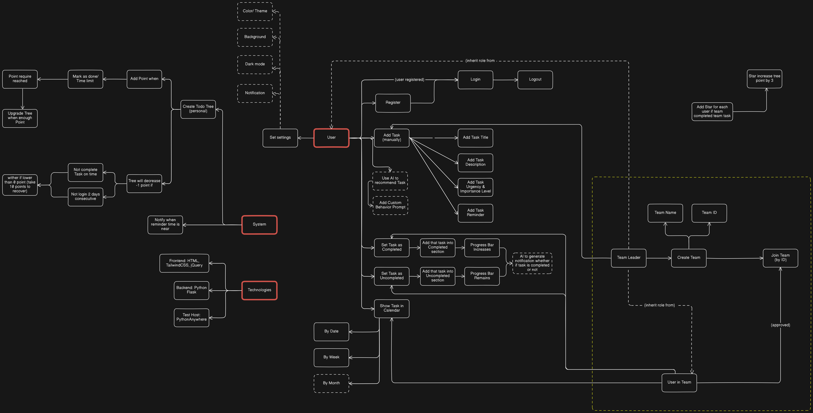
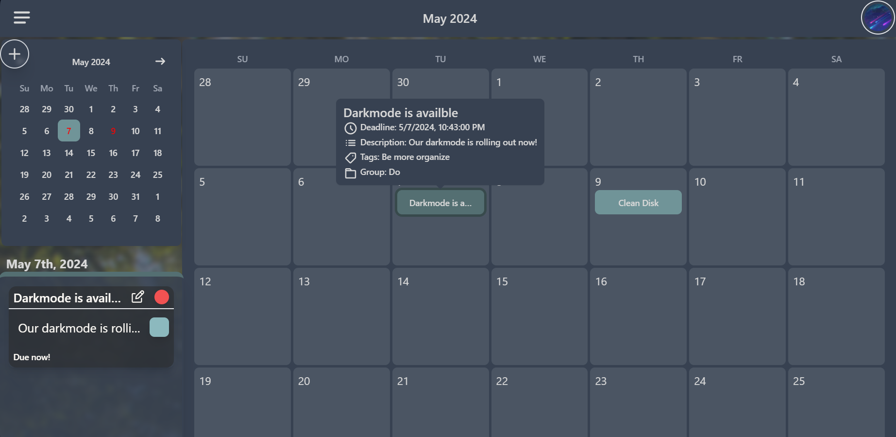
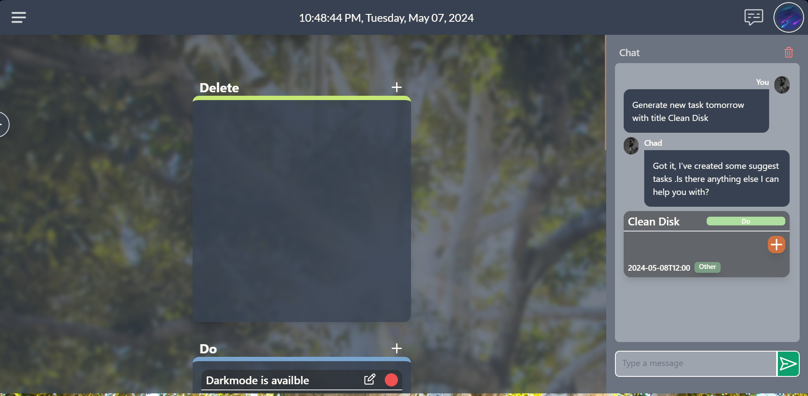
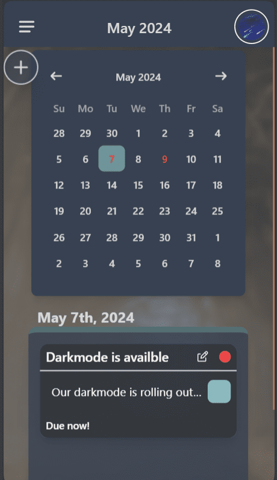

# ToDo-List
Web Application about Productivity Tracker - aka. ToDo List

Integrate AI and tree game

[Demo Link: https://to-do-list.live](https://to-do-list.live)

## Features:
- Create-Read-Update-Delete Todo List for personal & team
- Implement the Eisenhower Matrix for better managing Todo List
- Calendar for better task visualization like Google Calendar
- Automatically generate recommendations (create new todo, continue todo, manage list,...), ~~notifications and encouragements~~ using AI
- Todo Tree (Minigame)
  + will grow if tasks/missions completed
  + ~~will wither if there is expired tasks/missions~~

## Technologies:
- Frontend: HTML, TailwindCSS, jQuery + JavaScript
- Backend: Python Flask
- Database: MySQL
- Host: DigitalOcean

## Collaborators:
- Leader: JakeClark38a (Nguyễn Chí Thành - 22521350) (another account: JakeClark-chan)
- Sub-Leader: Witnull (Trần Nguyễn Tiến Thành - 22521364)
- SeaWind (Nguyễn Hải Phong - 22521088)
- KienSD (Hồ Trung Kiên - 22520704)
- lightunderwolft (Hồ Vĩnh Nhật - 22521013)

## Setup Website - General:
- Install Python Flask (pip install -r requirements.txt)
- Install MySQL
- Setup Flask Migrate
- Run web app using command: gunicorn -b 127.0.0.1:5000 app:app

# Setup Website - Details

## Prerequisites

Before you begin, ensure you have the following installed on your machine:

- Python 3.x
- MySQL Server
- pip (Python package installer)
- virtualenv (optional but recommended for managing project dependencies)

## Step-by-Step Instructions

### 1. Clone the Repository

First, clone the repository to your local machine:

```sh
git clone https://github.com/DataDefendersWithAI/ToDo-List-Backup
cd ToDo-List-Backup
```

### 2. Create and Activate a Virtual Environment (optional but recommended)

Create a virtual environment to manage your project's dependencies:

```sh
python -m venv venv
source venv/bin/activate  # On Windows use `venv\Scripts\activate`
```

### 3. Install Python Dependencies

Install the required Python packages listed in the `requirements.txt` file:

```sh
pip install -r requirements.txt
```

### 4. Install and Configure MySQL

Follow the instructions in `mysql-tutorial.txt` to install MySQL on your system. You can also refer to the official [MySQL Installation Guide](https://dev.mysql.com/doc/refman/8.0/en/installing.html) for detailed instructions.

### 5. Setup Flask-Migrate

Initialize Flask-Migrate to manage your database migrations:

#### 5.1 Initialize Migrate

Inside your Flask application directory, initialize Flask-Migrate:

```sh
flask db init
```

#### 5.2 Create an Initial Migration

Generate an initial migration script:

```sh
flask db migrate -m "Initial migration."
```

#### 5.3 Apply the Migration

Apply the migration to your database:

```sh
flask db upgrade
```

### 6. Run the Web Application

Use Gunicorn to run your Flask application. Gunicorn is a Python WSGI HTTP Server for UNIX that serves your application:

```sh
gunicorn -b 127.0.0.1:5000 app:app
```

*Feature Map*


**All below images update until night 08/05/2024**

*Feature Map - Progress*


**All below images update until night 07/05/2024**

*Few screenshot (desktop)*







*Few screenshot (mobile)*
...             |  ...
:-------------------------:|:-------------------------:
  |  
 | 
 | 
| 

[Timeline (Vietnamese - No implementation date - No update till now)](https://docs.google.com/spreadsheets/d/1MAMZZLN4X1kk-8I4zG77Cs-AGEdnr1_v/edit?usp=sharing&ouid=117486916258965576138&rtpof=true&sd=true)
